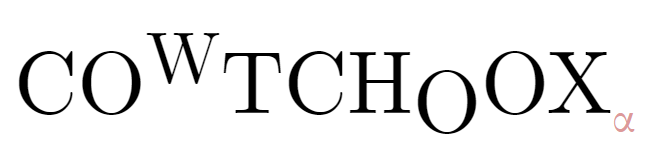

 

LATEX sucks.

Create small `pdf` documents, that hopefully looks like latex.
It's currently an alpha version, so nothing is working properly.

## What is it?

- Cowtchoox use a syntax that looks like html, with math that looks like latex
- It use a browser to render documents. So you can style you document easily with CSS
- Easier to debug: documented (not yet), clear error messages (not yet), and you can use the devtools of a browser to inspect your document

## How do I use that?

### Installation (Windows)

- Grab a release zip.
- Unzip it. Inside there is the executable and helpers files.
- Add to your PATH the folder into which you unzipped, so that you can call the executable from anywhere

### Usage 

- Create a `cow` file
- Call `cowtchoox my_file.cow`
- Cowtchoox will produce `out.pdf` in the same folder

See `docs\getting_started.pdf`

## Code organization
The main program is in rust
- `main`: read input, find files
- `parser`: parse COW files into a struct
    - `custom`: parse user-defined tags and operators
    - `math`: parse maths. used on the struct
- `writer`: create HTML file with document struct
- `browser`: send the shit to the browser, ask for a PDF

JS: is executed in the browser
- `main`: cuts the pages, instar headers etc.
